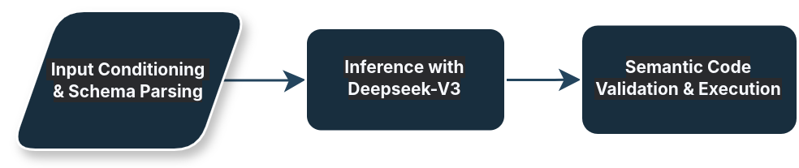

# DeepTabCoder: Code-based Retrieval and In-context Learning for Question-Answering over Tabular Data

Source code for **DeepTabCoder**, an advanced framework for question-answering over tabular data that integrates code-based retrieval with in-context learning.

## DeepTabCoder Pipeline


### Introduction
DeepTabCoder is a framework for question-answering over tabular data that combines code-based retrieval with in-context learning. Our system achieved **81.42%** accuracy on the DataBench dataset and **80.46%** on DataBench Lite at SemEval-2025 Task 8, outperforming baseline models by 3 times. Key features:

- 🛠️ **Code-based reasoning**: Generates executable Python code for precise table operations.
- 🔍 **Schema-aware prompts**: Maintains table structure through metadata injection.
- ⚡ **Efficient execution**: Modular functions for data loading and value retrieval.
- 📈 **Multi-dataset support**: Handles both full DataBench and DataBench Lite variants.

Inspired by the **[TART: Tool-Augmented Reasoning for Tables](https://github.com/XinyuanLu00/TART)** framework, DeepTabCoder extends tool-augmented reasoning with dataset-specific prompt engineering and DeepSeek-V3 code generation.

## Project Structure
```
├── datasets/              # Dataset-specific prompts
│   ├── competition.txt/
|       └── 066_IBM_HR
|       └── 067_TripAdvisor
|       └── ...
│   └── question/
|       └── train.json     # Questions 
├── prompts/               # Dataset-specific prompts
│   ├── prompt_066_IBM_HR.txt
│   └── prompt_067_TripAdvisor.txt
|   └── ...
├── code_execution.py      # Code parsing and execution
├── deep_tool_factory.py   # Generating Prompt and LLM inference
├── requirements.txt
├── run.sh
└── utils.py
```

## Setup & Installation

```bash
# Clone repository
git clone https://github.com/2036saharsha/DeepTabCoder.git

# Install dependencies
pip install -r requirements.txt
```

## Usage
```bash
# Execute the run.sh script
bash run.sh
```

## Acknowledgements
This work builds upon these foundational projects:
- **[TART](https://github.com/XinyuanLu00/TART)** (Tool-Augmented Reasoning for Tables): We have made modifications to their code.